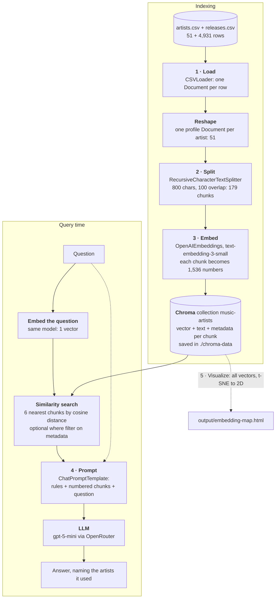
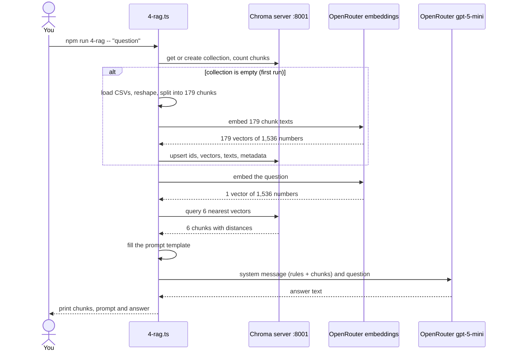

# Semantic search + RAG prototype (LangChain)

A learning prototype for the parts of a semantic search engine, built on a music dataset of 51 artists and about 4.9k releases from MusicBrainz. The data is in `data/`; see [data/README.md](data/README.md) for its source and licence.

## See the results

These pages come from the latest run. They're committed in `output/` and published with GitHub Pages, so you can open them without running anything:

- **[Walkthrough](https://derykhopley.github.io/tc-ai-experiments/rag-langchain/output/walkthrough.html)**: one question followed through all 12 steps, from CSV row to answer, with the real data at each step.
- **[Embedding map](https://derykhopley.github.io/tc-ai-experiments/rag-langchain/output/embedding-map.html)**: every chunk on a 2D t-SNE map, with genre and artist highlights and what each query retrieves.

## Setup

- Node 22 or later
- `npm install`. `.npmrc` sets `legacy-peer-deps`, because an optional peer of `@langchain/community` (`@getzep/zep-cloud`) still pins `@langchain/core` 0.3.
- Copy `.env.example` to `.env` and add an [OpenRouter](https://openrouter.ai) key. Stages 1 and 2 run without one.
- Stages 3 and 4 need the Chroma server: run `npm run chroma` in a second terminal. It stores vectors in `./chroma-data` and listens on port 8001, so it doesn't clash with another Chroma server on the default port 8000.

## Stages

Run the stages in order. Each one reuses the earlier stages from `src/lib/pipeline.ts` and prints what its own step produces.

| Script | Concept | What you see |
| --- | --- | --- |
| `npm run 1-load` | Document loaders | `CSVLoader` returns one Document per row (4,931 release rows). These are reshaped into 51 artist profile Documents. |
| `npm run 2-split` | Text splitters | `RecursiveCharacterTextSplitter` (800 characters, 100 overlap) turns the 51 profiles into 179 chunks. Metadata is copied to every chunk. Chunks that lost the artist name get it added back. |
| `npm run 3-search` | Embeddings + vector store | One raw 1536-number vector, then Chroma similarity search (cosine distance, lower is closer), a check against `music_ground_truths.json`, and a `where`-filtered search. |
| `npm run 4-rag -- "question"` | RAG | Retrieve 6 chunks, fill a `ChatPromptTemplate`, then `gpt-5-mini` answers using only that context. |
| `npm run 5-visualize` | Looking at embeddings | Writes `output/embedding-map.html`: every chunk on a 2D t-SNE map, with genre or artist highlights, each query's top 6 retrieved chunks, and a nearest-neighbour check on the full vectors. |
| `npm run 6-walkthrough -- "question"` | The whole pipeline, one question | Writes `output/walkthrough.html`. It follows one real question through all 12 steps, with the data each step produced: CSV row, Document, chunks (overlap marked), the vector as a colour strip, the search with the cut-off, how the #1 score adds up, the filled prompt, token counts and the answer. |
| `npm run reindex` | Rebuild the index | Drops the collection and embeds everything again. |

## How it flows

The pipeline runs in two phases. **Indexing** turns the CSVs into vectors in Chroma. It runs on the first stage 3/4 run that finds the collection empty, and again on `npm run reindex`. **Query time** runs for every question. The numbers on the boxes are the stage scripts.

The same thing as a UML sequence diagram for one `npm run 4-rag` run: who calls whom, and in what order. The `alt` block only happens on the first run.

## Persistence

The first stage 3 or 4 run that finds the `music-artists` collection empty embeds the 179 chunks and stores them. Later runs reuse the stored vectors and only embed the query. Chunk ids are stable (`<artist_mbid>-<n>`), so re-adding a chunk updates it instead of duplicating it.

Stored vectors don't change when the code does. After changing the loader, splitter or embedding model, run `npm run reindex`. Otherwise you're searching vectors from the old pipeline.

Models: `openai/text-embedding-3-small` and `openai/gpt-5-mini`, both through OpenRouter.

## Things the output shows

- **Shaping Documents matters more than the loader.** Searching raw release rows would mostly match album titles. One profile per artist matches what questions are actually about.
- **Chunks lose context.** A chunk from the middle of a discography is just a list of titles. Without the `Artist: X (continued)` header, neither the embedding nor the LLM knows whose albums they are.
- **Retrieval returns chunks, not artists.** One artist can fill several of the top-k slots. In "Indian film music…", 15 chunks covered only 4 artists. In the RAG example, JAŸ-Z took 3 of the 6 slots.
- **RAG is capped by retrieval.** For Beyoncé, only the tags chunk was retrieved, so the model correctly says it can't list her albums, even though they're in the data.
- **Facts are better as filters.** "Female singers from the UK" works best as a metadata filter (`gender`, `country`) plus a semantic query.
- **The prompt controls refusal.** For a question the data can't answer, the model replies "I don't know based on the data."
- **Chunks group by artist, not by genre.** In the full 1,536 dimensions, every discography chunk's nearest neighbour is another chunk by the same artist. 91% of the time it's another discography chunk. The `Artist: X (continued)` header ties them together. Genre shows up a level above that: on the map, artists with hip hop tags occupy one region.
- **Profile chunks carry the meaning.** The nearest neighbour of 92% of profile chunks is the same artist's own discography chunk. Only 8% sit closest to another artist's profile. Genre search therefore relies on the tags in the profile chunk.
- **Queries sit at the edge of the map.** A short question is about 0.5–0.6 cosine distance from even its best match, which is further than chunks of the same artist are from each other. That's normal for question-to-document search, and it's why scores are only meaningful compared with each other.

The genre families on the map are regex matches on MusicBrainz tags (`GENRES` in `src/5-visualize.ts`), so they're approximate. An artist can be in several families, and the tags are crowd-sourced.
